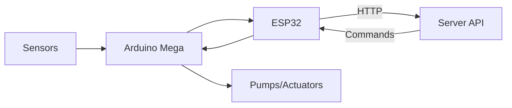
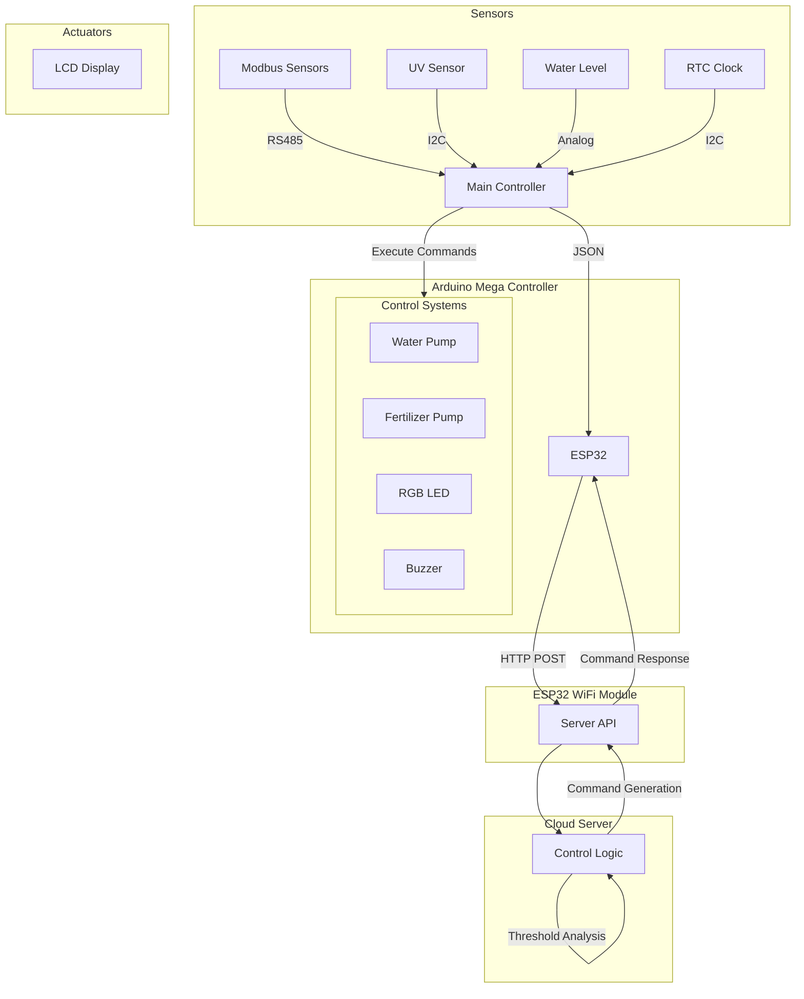
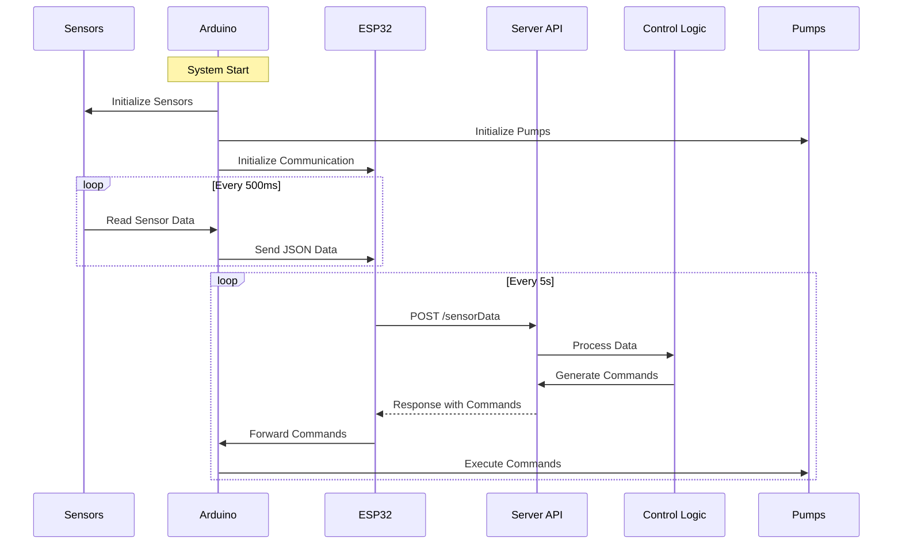
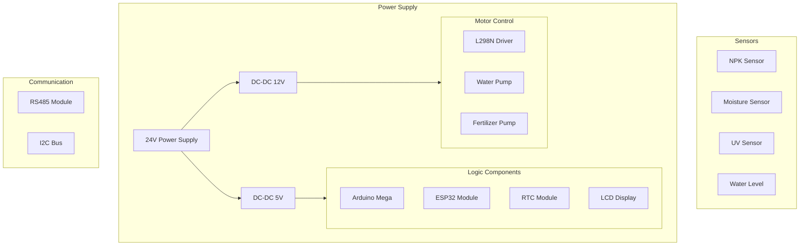
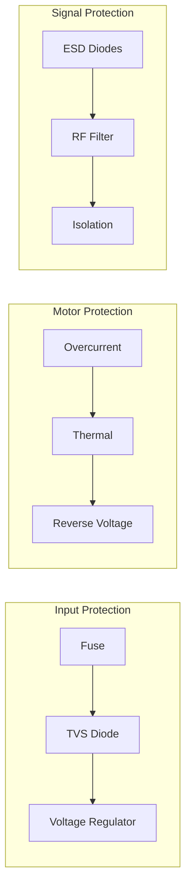

# EcoFarmIQ Farm IoT Firmware Documentation

## System Architecture Overview

### High-Level Architecture



### Detailed Data Flow



### Operation Sequence



The EcoFarmIQ Farm system uses a dual-microcontroller architecture with server-side control logic:

1. **Arduino Mega**: Primary controller handling sensors and actuator execution
2. **ESP32**: WiFi communication and API interaction
3. **Cloud Server**: Control logic and decision making

## Hardware Design

### Component Layout



### Wiring Best Practices

1. **Power Distribution**

   - Use thick gauge wires (14-16 AWG) for 24V power lines
   - Implement proper grounding scheme
   - Add decoupling capacitors near ICs
   - Use separate power rails for motors and logic

2. **Signal Integrity**

   - Keep signal wires away from power lines
   - Use twisted pairs for differential signals
   - Shield sensitive analog signals
   - Implement pull-up/pull-down resistors where needed

3. **Motor Control**
   - Use snubber diodes across motor terminals
   - Implement emergency stop circuit
   - Add current sensing for motor protection
   - Use shielded cables for motor connections

### PCB Design Guidelines

1. **Board Layout**

   - 4-layer board recommended
     - Layer 1: Signal and components
     - Layer 2: Ground plane
     - Layer 3: Power planes
     - Layer 4: Signal and high-current traces
   - Separate analog and digital grounds
   - Use ground pour on all layers
   - Place bypass capacitors close to ICs

2. **Component Placement**
   - Group related components together
   - Keep sensitive components away from noise sources
   - Place connectors at board edges
   - Add mounting holes at corners

### Protection Circuits



### Connector Specifications

| Connection Type | Connector      | Wire Gauge | Notes               |
| --------------- | -------------- | ---------- | ------------------- |
| Power Input     | XT60           | 14 AWG     | Polarized connector |
| Motor Output    | Terminal Block | 16 AWG     | Screw terminal      |
| Sensors         | JST-XH         | 22 AWG     | Locking connector   |
| Communication   | Terminal Block | 22 AWG     | RS485 connections   |
| Programming     | Header Pins    | 24 AWG     | ISP/UART headers    |

### Environmental Considerations

1. **Enclosure Design**

   - IP65 rated enclosure
   - Gore vent for pressure equalization
   - Cable glands for all external connections
   - Cooling considerations
     - Ventilation holes with filters
     - Heat sinks on power components
     - Temperature monitoring

2. **EMI/EMC Protection**
   - Ferrite beads on power lines
   - EMI shields over sensitive circuits
   - Proper grounding scheme
   - Filter capacitors on power rails

### Assembly Guidelines

1. **Component Assembly**

   - Use lead-free solder
   - Apply conformal coating
   - Heat shrink on all wire connections
   - Label all connectors and cables

2. **Quality Control**
   - Visual inspection points
   - Electrical testing procedures
   - Burn-in testing requirements
   - Calibration procedures

### Bill of Materials (Critical Components)

| Component    | Specification  | Quantity | Notes                 |
| ------------ | -------------- | -------- | --------------------- |
| Power Supply | 24V, 10A       | 1        | Mean Well type        |
| Arduino Mega | ATmega2560     | 1        | Original Arduino      |
| ESP32        | NodeMCU        | 1        | With external antenna |
| L298N        | Dual H-Bridge  | 2        | Heat sink required    |
| RS485 Module | MAX485         | 1        | With isolation        |
| NPK Sensor   | RS485 Protocol | 1        | Industrial grade      |
| LCD Display  | 20x4 I2C       | 1        | With backlight        |
| Enclosure    | 400x300x150mm  | 1        | IP65 rated            |

### Hardware Testing Procedures

1. **Power System Test**

   - Input voltage range test
   - Regulation efficiency
   - Ripple measurement
   - Load testing

2. **Signal Testing**

   - Communication bus integrity
   - Sensor calibration
   - Motor control accuracy
   - Protection circuit verification

3. **Environmental Testing**
   - Temperature cycle test
   - Humidity resistance
   - Vibration tolerance
   - Water resistance

## Detailed Component Breakdown

### 1. Sensors & Input Devices

#### Environmental Sensors

- **Modbus Sensors** (RS485 Protocol)
  - Soil Moisture
  - Soil Temperature
  - Nitrogen (N) Level
  - Phosphorus (P) Level
  - Potassium (K) Level

#### Additional Sensors

- **UV Sensor** (SI1145)

  - UV Index monitoring
  - Visible light detection
  - Infrared light detection

- **Water Level Sensor**

  - Analog input (A0)
  - Monitors water reservoir level

- **Real-Time Clock** (DS3231)
  - Accurate timestamping
  - Power loss detection
  - Automatic time sync

### 2. Actuators & Output Devices

#### Pump Systems

1. **Water Pump (Motor 1)**

   - Control Pins:
     - IN1: Pin 30
     - IN2: Pin 31
     - EN: Pin 6 (PWM)
   - API Control:
     ```
     Endpoint: /api/sensorCommand/water-pump
     Commands:
     - ON: Activate pump at default power (90%)
     - OFF: Deactivate pump
     - SPEED,value: Set pump power (0-100%)
     ```

2. **Fertilizer Pump (Motor 2)**
   - Control Pins:
     - IN1: Pin 24
     - IN2: Pin 25
     - EN: Pin 5 (PWM)
   - API Control:
     ```
     Endpoint: /api/sensorCommand/fertilizer-pump
     Commands:
     - ON: Activate pump at default power (90%)
     - OFF: Deactivate pump
     - SPEED,value: Set pump power (0-100%)
     ```

#### Feedback Devices

- **LCD Display** (16x4 I2C)

  - Real-time sensor readings
  - System status
  - Error messages

- **RGB LED Indicator**

  - RED: Error/Warning
  - GREEN: Normal Operation
  - BLUE: Communication Active

- **Buzzer** (Pin 26)
  - Alerts for critical conditions
  - System startup indication

### 3. Communication System

#### Arduino-ESP32 Communication

- **Serial Interface**
  - Baud Rate: 9600
  - Arduino TX → ESP32 RX (Pin 21)
  - Arduino RX → ESP32 TX (Pin 22)
  - JSON Data Format:
    ```json
    {
        "moisture": float,
        "temperature": float,
        "waterLevel": float,
        "nitrogen": int,
        "phosphorus": int,
        "potassium": int,
        "ph": float,
        "uvIndex": float
    }
    ```
  - Command Format:
    ```
    CMD:LED,color,mode;BUZZER,time;WPUMP,state;FPUMP,state;
    ```

#### ESP32-Server Communication

- **API Endpoints**
  - Sensor Data: `/api/sensorData`
  - Water Pump: `/api/sensorCommand/water-pump`
  - Fertilizer Pump: `/api/sensorCommand/fertilizer-pump`
  - Alerts:
    ```
    GET /api/sensorCommand/temperature-high-alert
    GET /api/sensorCommand/temperature-low-alert
    GET /api/sensorCommand/moisture-high-alert
    GET /api/sensorCommand/moisture-low-alert
    GET /api/sensorCommand/water-level-alert
    GET /api/sensorCommand/ph-high-alert
    GET /api/sensorCommand/ph-low-alert
    GET /api/sensorCommand/nitrogen-high-alert
    GET /api/sensorCommand/nitrogen-low-alert
    GET /api/sensorCommand/phosphorus-high-alert
    GET /api/sensorCommand/phosphorus-low-alert
    GET /api/sensorCommand/potassium-high-alert
    GET /api/sensorCommand/potassium-low-alert
    ```

### 4. Control Logic

#### Server-Side Control

- Threshold analysis
- Decision making
- Command generation
- Alert management

#### Arduino-Side Control

- Command execution
- Hardware control
- Safety checks
- Status reporting

## Pin Configuration Summary

### Arduino Mega

```
Communication Pins:
- MAX485_RE_DE: 23 (RS485)
- Serial1: RS485 sensors
- Serial3: ESP32 communication

Motor Control:
Water Pump (Motor 1)
- IN1: 30
- IN2: 31
- EN: 6 (PWM)

Fertilizer Pump (Motor 2)
- IN1: 24
- IN2: 25
- EN: 5 (PWM)

Indicators:
- BUZZER: 26
- RGB_RED: 27
- RGB_GREEN: 28
- RGB_BLUE: 29
- WATER_LEVEL: A0
```

### ESP32

```
Serial Communication:
- RX2: 21 (from Arduino)
- TX2: 22 (to Arduino)
```

## Operation Flow

1. **Startup Sequence**

   - System initialization
   - Sensor calibration
   - Communication setup
   - 3-second safety delay

2. **Main Operation Loop**

   - Sensor data collection
   - Control logic execution
   - Data transmission
   - Status updates

3. **Control Logic**

   - Automated irrigation control
   - Fertilizer management
   - Real-time monitoring
   - Error checking

4. **Data Management**
   - Local logging
   - Cloud synchronization
   - Status display
   - Alert handling

## Troubleshooting Guide

### Common Issues

1. **No Sensor Readings**

   - Check RS485 connections
   - Verify power supply
   - Check Modbus address settings

2. **Pump Not Activating**

   - Check water level
   - Verify pump connections
   - Check threshold settings

3. **Communication Errors**
   - Check WiFi settings
   - Verify serial connections
   - Check server status

### LED Status Codes

- **Solid Green**: Normal operation
- **Blinking Green**: Active control
- **Red**: Error condition
- **Blue**: Data transmission

## Future Improvements

1. **Planned Enhancements**

   - Machine learning integration
   - Weather data integration
   - Mobile app control
   - Advanced analytics

2. **Potential Upgrades**
   - Additional sensor types
   - Expanded control systems
   - Enhanced user interface
   - Remote management

## Maintenance

### Regular Tasks

1. **Daily**

   - Check sensor readings
   - Monitor pump operation
   - Verify data transmission

2. **Weekly**

   - Clean sensors
   - Check water levels
   - Verify calibration

3. **Monthly**
   - System backup
   - Hardware inspection
   - Software updates

### Calibration

- Soil sensors: Monthly
- Water level: Weekly
- pH sensors: Bi-weekly

## API Integration

### Available Endpoints

1. **Sensor Data**

   - `POST /api/sensorData`
   - Accepts JSON sensor readings
   - Returns control commands if needed

2. **Direct Control**

   - `GET /api/sensorCommand/water-pump`
   - `GET /api/sensorCommand/fertilizer-pump`
   - `GET /api/sensorCommand/buzzer`

3. **Alert Endpoints**
   ```
   GET /api/sensorCommand/temperature-high-alert
   GET /api/sensorCommand/temperature-low-alert
   GET /api/sensorCommand/moisture-high-alert
   GET /api/sensorCommand/moisture-low-alert
   GET /api/sensorCommand/water-level-alert
   GET /api/sensorCommand/ph-high-alert
   GET /api/sensorCommand/ph-low-alert
   GET /api/sensorCommand/nitrogen-high-alert
   GET /api/sensorCommand/nitrogen-low-alert
   GET /api/sensorCommand/phosphorus-high-alert
   GET /api/sensorCommand/phosphorus-low-alert
   GET /api/sensorCommand/potassium-high-alert
   GET /api/sensorCommand/potassium-low-alert
   ```

### Response Format

```json
{
    "success": boolean,
    "led": {
        "color": "red|green|blue",
        "blink": boolean,
        "on": boolean
    },
    "buzzer": {
        "time": integer
    },
    "message": string
}
```
