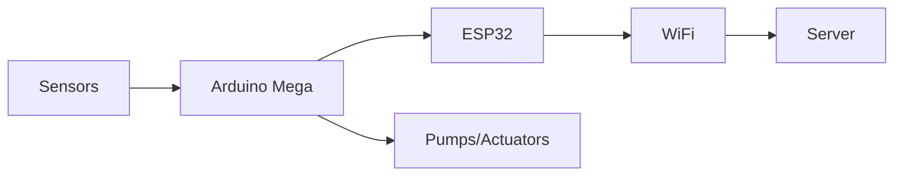
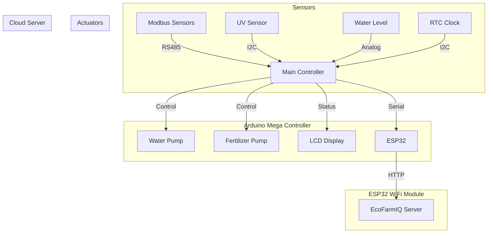
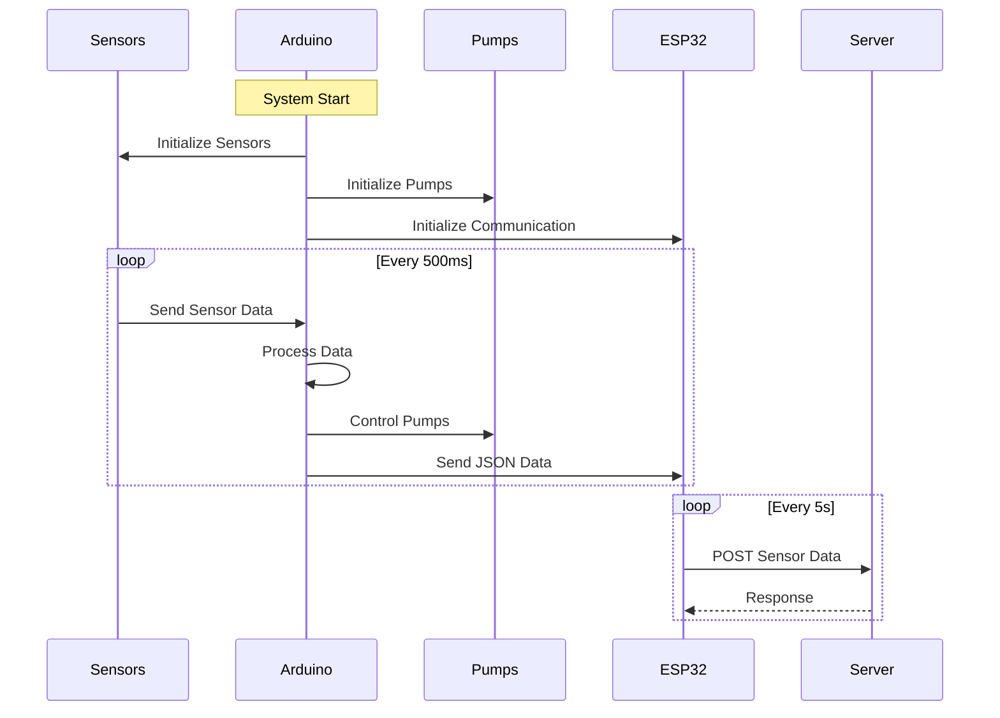

# EcoFarmIQ Farm IoT Firmware Documentation

## System Architecture Overview

### High-Level Architecture



### Detailed Data Flow



### Operation Sequence



The EcoFarmIQ Farm system uses a dual-microcontroller architecture for robust farm automation and monitoring:

1. **Arduino Mega**: Primary controller handling sensors and actuators
2. **ESP32**: Secondary controller managing WiFi communication
3. **Cloud Server**: Remote data storage and monitoring interface

## Detailed Component Breakdown

### 1. Sensors & Input Devices

#### Environmental Sensors

- **Modbus Sensors** (RS485 Protocol)
  - Soil Moisture
  - Soil Temperature
  - Nitrogen (N) Level
  - Phosphorus (P) Level
  - Potassium (K) Level

#### Additional Sensors

- **UV Sensor** (SI1145)

  - UV Index monitoring
  - Visible light detection
  - Infrared light detection

- **Water Level Sensor**

  - Analog input (A0)
  - Monitors water reservoir level

- **Real-Time Clock** (DS3231)
  - Accurate timestamping
  - Power loss detection
  - Automatic time sync

### 2. Actuators & Output Devices

#### Pump Systems

1. **Water Pump (Motor 1)**

   - Control Pins:
     - IN1: Pin 30
     - IN2: Pin 31
     - EN: Pin 6 (PWM)
   - Activation Logic:
     ```cpp
     if (moisture < 20%) -> ON @ 90% power
     if (moisture > 30%) -> OFF
     ```

2. **Fertilizer Pump (Motor 2)**
   - Control Pins:
     - IN1: Pin 24
     - IN2: Pin 25
     - EN: Pin 5 (PWM)
   - Activation Logic:
     ```cpp
     if (nitrogen < 30) -> ON @ 90% power
     if (nitrogen > 40) -> OFF
     ```

#### Feedback Devices

- **LCD Display** (16x4 I2C)

  - Real-time sensor readings
  - System status
  - Error messages

- **RGB LED Indicator**

  - RED: Error/Warning
  - GREEN: Normal Operation
  - BLUE: Communication Active

- **Buzzer** (Pin 26)
  - Alerts for critical conditions
  - System startup indication

### 3. Communication System

#### Arduino-ESP32 Communication

- **Serial Interface**
  - Baud Rate: 9600
  - Arduino TX → ESP32 RX (Pin 21)
  - Arduino RX → ESP32 TX (Pin 22)
  - JSON data format

#### ESP32-Server Communication

- **WiFi Configuration**

  - Auto-reconnect capability
  - 20 retry attempts
  - Status LED indication

- **Server Integration**
  - Endpoint: `https://ecofarmiq-final.onrender.com/api/sensorData`
  - POST requests every 5 seconds
  - JSON payload format

### 4. Safety Features & Error Handling

#### System Protection

- 3-second startup delay
- Water level monitoring
- Pump overrun protection
- Power loss detection

#### Error Handling

- Sensor initialization checks
- Communication timeout handling
- WiFi connection management
- Data validation

## Pin Configuration Summary

### Arduino Mega

```
Communication Pins:
- MAX485_RE_DE: 23 (RS485)
- Serial1: RS485 sensors
- Serial3: ESP32 communication

Motor Control:
Water Pump (Motor 1)
- IN1: 30
- IN2: 31
- EN: 6 (PWM)

Fertilizer Pump (Motor 2)
- IN1: 24
- IN2: 25
- EN: 5 (PWM)

Indicators:
- BUZZER: 26
- RGB_RED: 27
- RGB_GREEN: 28
- RGB_BLUE: 29
- WATER_LEVEL: A0
```

### ESP32

```
Serial Communication:
- RX2: 21 (from Arduino)
- TX2: 22 (to Arduino)
```

## Operation Flow

1. **Startup Sequence**

   - System initialization
   - Sensor calibration
   - Communication setup
   - 3-second safety delay

2. **Main Operation Loop**

   - Sensor data collection
   - Control logic execution
   - Data transmission
   - Status updates

3. **Control Logic**

   - Automated irrigation control
   - Fertilizer management
   - Real-time monitoring
   - Error checking

4. **Data Management**
   - Local logging
   - Cloud synchronization
   - Status display
   - Alert handling

## Troubleshooting Guide

### Common Issues

1. **No Sensor Readings**

   - Check RS485 connections
   - Verify power supply
   - Check Modbus address settings

2. **Pump Not Activating**

   - Check water level
   - Verify pump connections
   - Check threshold settings

3. **Communication Errors**
   - Check WiFi settings
   - Verify serial connections
   - Check server status

### LED Status Codes

- **Solid Green**: Normal operation
- **Blinking Green**: Active control
- **Red**: Error condition
- **Blue**: Data transmission

## Future Improvements

1. **Planned Enhancements**

   - Machine learning integration
   - Weather data integration
   - Mobile app control
   - Advanced analytics

2. **Potential Upgrades**
   - Additional sensor types
   - Expanded control systems
   - Enhanced user interface
   - Remote management

## Maintenance

### Regular Tasks

1. **Daily**

   - Check sensor readings
   - Monitor pump operation
   - Verify data transmission

2. **Weekly**

   - Clean sensors
   - Check water levels
   - Verify calibration

3. **Monthly**
   - System backup
   - Hardware inspection
   - Software updates

### Calibration

- Soil sensors: Monthly
- Water level: Weekly
- pH sensors: Bi-weekly
