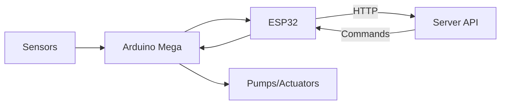
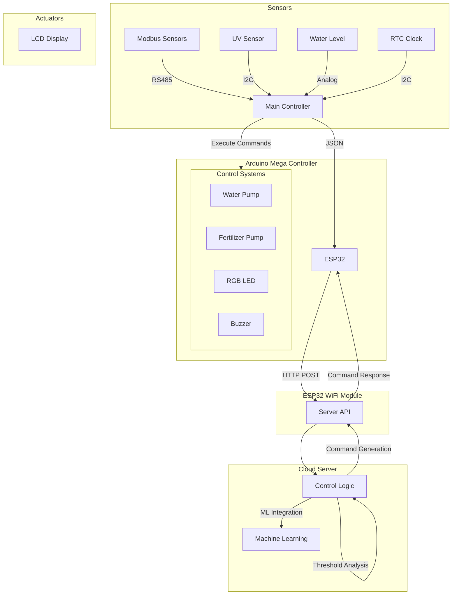

# EcoFarmIQ - Smart Agriculture Management System

## Overview

EcoFarmIQ is a comprehensive smart agriculture management system that combines IoT technology, machine learning, and real-time monitoring to optimize farm operations. The system provides automated irrigation, fertilization, and environmental monitoring while offering insights through an intuitive web interface.

### System Architecture

#### High-Level Overview



#### Detailed System Flow



## Features

### 1. Smart Irrigation System

- **API-Driven Water Management**
  - Server-controlled thresholds
  - Real-time soil moisture monitoring
  - Intelligent watering schedules
  - Dynamic pump speed control
  - Water usage optimization
  - Reservoir level tracking

### 2. Fertilization Control

- **API-Driven Nutrient Management**
  - Server-controlled NPK thresholds
  - Automated fertilizer dispensing
  - Variable rate application
  - Custom nutrient profiles
  - Historical tracking

### 3. Environmental Monitoring

- **Comprehensive Sensing**
  - Temperature tracking
  - Humidity monitoring
  - UV exposure measurement
  - Soil condition analysis

### 4. Crop Recommendation System

- **ML-Powered Insights**
  - Soil suitability analysis
  - Weather pattern integration
  - Seasonal recommendations
  - Yield optimization

### 5. Real-time Dashboard

- **Intuitive Monitoring Interface**
  - Live sensor readings
  - System status updates
  - Alert notifications
  - Historical data visualization

## Technical Architecture

### 1. Hardware Components

#### IoT Hardware

- **Microcontrollers**

  - Arduino Mega (Main Controller)
  - ESP32 (WiFi Communication)

- **Sensors**

  - Modbus Soil Sensors (NPK, Moisture)
  - UV Sensor (SI1145)
  - Water Level Sensor
  - Real-Time Clock (DS3231)

- **Actuators**
  - Water Pump System
  - Fertilizer Dispensing System
  - LCD Display (16x4)
  - Status Indicators (RGB LED)

### 2. Software Stack

#### Frontend (React.js)

- **Key Features**
  - Real-time data updates
  - Interactive dashboards
  - Responsive design
  - Cross-platform compatibility

#### Backend (Node.js + Express)

- **Core Functions**
  - RESTful API endpoints
  - Real-time event handling
  - Threshold management
  - Control logic processing
  - Data validation
  - Authentication system

#### Machine Learning (Python)

- **Capabilities**
  - Crop recommendation
  - Yield prediction
  - Weather analysis
  - Soil health assessment

### 3. Communication System

#### Command Protocol

- **JSON Data Format (Arduino to ESP32)**

  ```json
  {
    "moisture": float,
    "temperature": float,
    "waterLevel": float,
    "nitrogen": int,
    "phosphorus": int,
    "potassium": int,
    "ph": float,
    "uvIndex": float
  }
  ```

- **Command Format (ESP32 to Arduino)**
  ```
  CMD:LED,color,mode;BUZZER,time;WPUMP,state;FPUMP,state;
  ```

#### API Endpoints

1. **Sensor Data**

   ```http
   POST /api/sensorData
   Content-Type: application/json

   {
     "moisture": 45.5,
     "temperature": 25.2,
     "waterLevel": 80,
     "nitrogen": 35,
     "phosphorus": 40,
     "potassium": 45,
     "ph": 6.8,
     "uvIndex": 5.2
   }
   ```

2. **Control Commands**

   ```http
   GET /api/sensorCommand/water-pump
   Response:
   {
     "success": true,
     "command": "ON",
     "speed": 90,
     "message": "Activating water pump"
   }
   ```

3. **Alert Endpoints**
   ```http
   GET /api/sensorCommand/moisture-high-alert
   GET /api/sensorCommand/moisture-low-alert
   GET /api/sensorCommand/nitrogen-high-alert
   GET /api/sensorCommand/nitrogen-low-alert
   [... other alert endpoints]
   ```

### 4. Control Logic

#### Server-Side Processing

- Threshold analysis
- Decision making
- Command generation
- Alert management
- Historical data analysis
- ML model integration

#### Hardware-Side Execution

- Command parsing
- Actuator control
- Safety checks
- Status reporting
- Error handling

## Installation & Setup

### 1. Hardware Setup

```bash
# Directory Structure
IOT_Firmware/
├── Arduino/         # Main controller firmware
├── ESP32/          # WiFi module firmware
└── Documentation/  # Setup guides
```

### 2. Server Setup

```bash
# Install dependencies
npm install

# Configure environment
cp .env.example .env
# Edit .env with your settings

# Start server
npm start
```

### 3. Client Setup

```bash
# Navigate to client directory
cd client

# Install dependencies
npm install

# Start development server
npm run dev
```

## API Documentation

### 1. Sensor Data Endpoints

```javascript
POST / api / sensorData; // Submit sensor readings
GET / api / sensorData / latest; // Get latest readings
GET / api / sensorData / history; // Get historical data
```

### 2. Control Endpoints

```javascript
GET / api / sensorCommand / water - pump; // Water pump control
GET / api / sensorCommand / fertilizer - pump; // Fertilizer control
GET / api / sensorCommand / buzzer; // Buzzer control
```

### 3. Analysis Endpoints

```javascript
GET / api / analysis / crop; // Get crop recommendations
GET / api / analysis / weather; // Get weather analysis
GET / api / analysis / soil; // Get soil health report
```

### 4. Response Format

```json
{
    "success": boolean,
    "led": {
        "color": "red|green|blue",
        "blink": boolean,
        "on": boolean
    },
    "buzzer": {
        "time": integer
    },
    "message": string
}
```

## System Monitoring

### 1. Real-time Monitoring

- Sensor data updates (500ms interval)
- System status checks
- Alert notifications
- Performance metrics

### 2. Data Logging

- Sensor readings
- System events
- Error logs
- Performance data

### 3. Alert System

- Critical condition alerts
- System malfunction warnings
- Maintenance reminders
- Resource level notifications

## Maintenance

### 1. Regular Tasks

- Daily system checks
- Weekly sensor calibration
- Monthly backup procedures
- Quarterly hardware inspection

### 2. Troubleshooting

- Error code reference
- Common issues guide
- Debug procedures
- Support contacts

## Security Features

### 1. Hardware Security

- Encrypted communication
- Physical access controls
- Sensor data validation
- Firmware security

### 2. Software Security

- JWT authentication
- HTTPS encryption
- Rate limiting
- Input validation

## Future Roadmap

### 1. Planned Features

- Mobile application
- Advanced analytics
- Weather integration
- Automated reporting

### 2. Upcoming Improvements

- Enhanced ML models
- Additional sensor support
- Extended automation
- UI/UX enhancements

## Contributing

We welcome contributions! Please see our contributing guide for details.

### Development Process

1. Fork the repository
2. Create feature branch
3. Submit pull request
4. Code review
5. Merge to main

## License

This project is licensed under the MIT License - see the LICENSE file for details.

## Support

For support and queries:

- Documentation: [docs.ecofarmiq.com](https://docs.ecofarmiq.proghubs.com)
- Issues: GitHub Issues

## Acknowledgments

- Contributors
- Open source community
- Testing partners
- Agricultural experts

---

© 2025 EcoFarmIQ. All Rights Reserved.
